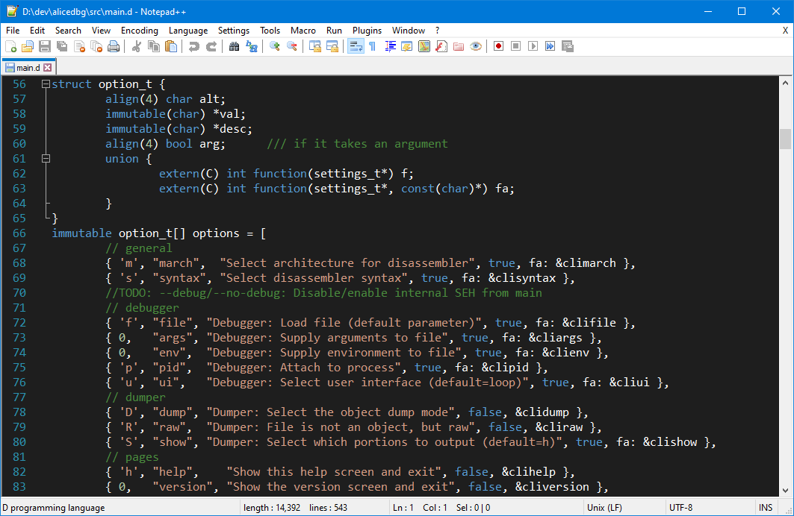

Despite using VSCodium as my default code editor, sometimes I still use
Notepad++ for quick edits. Recently updated to support D.

Typically installed in `%APPDATA%\Notepad++\themes`.

Tested for:
- assembly (x86)
- batch
- c
- c++
- css
- d
- diff
- html
- ini